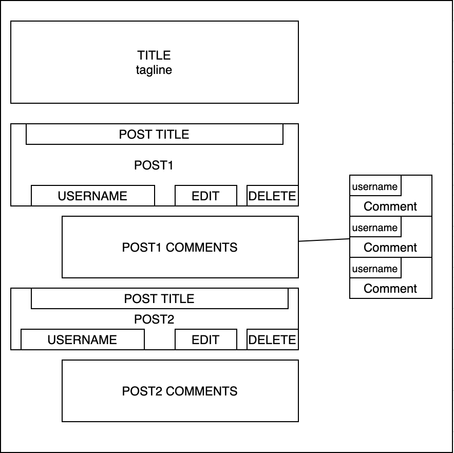

# GA Second Project
### Second Project for General Assembly SEI-ANZ-SEIFXR05

Build a full-stack database-backed application.
Requirements:
Your app must:
* Have at least 2 tables (more if they make sense) – one of them should represent the people using your application (users).
* Include sign up/log in functionality (if it makes sense), with encrypted passwords & an authorization flow
* Modify data in the database There should be ways for users to add/change some data in the database (it's ok if only admins can make changes).
* Have semantically clean HTML and CSS
* Be deployed online and accessible to the public

## Project Outline
### Message board for bread enthusiasts.

Create a messageboard where people can post about bread; such as bakeries, recipes and tips and tricks for creating the perfect bread.

This idea is a parody of reddit called breaddit - and will have common messageboard functionality - post, delete, like, dislike and comment and photos.

The website will require users to create an account and login to access the functionality. 

## Special Thanks

This project would not be possible without the consultancy and feedback from fellow students [Alwin - Keypuncher](https://github.com/keypuncheralwin) and [Hayden](), my partner [Meggan](https://github.com/megganeturner) and the users of our [Twitch](twitch.tv) discord community Chaos Kingdom.
- [Mego](https://www.twitch.tv/megomegomego)
- [ConnivingPrincess](https://www.twitch.tv/theconnivingprincess)
- [JohnnyOnTheSpot](https://www.twitch.tv/johnnyonthespot5)

## Website Link
[GA Project App](https://ga-first-heroku-project.herokuapp.com/)

## Utilizing this repo locally

The dependencies for this project are: 
- Flask
- BCrypt
- PsycopG2
- Cloudinary
- Venv

After cloning this repository - use the command -

Create a local virtual environment using: 

`python -m venv venv`

Run the environment:

`source venv/bin/activate`

Install the dependencies for the site:

`pip install -r requirements.txt`

For the database installation - please create a database name projectheroku and use code found in the schema.sql file with your preferred database system.

## Templates

